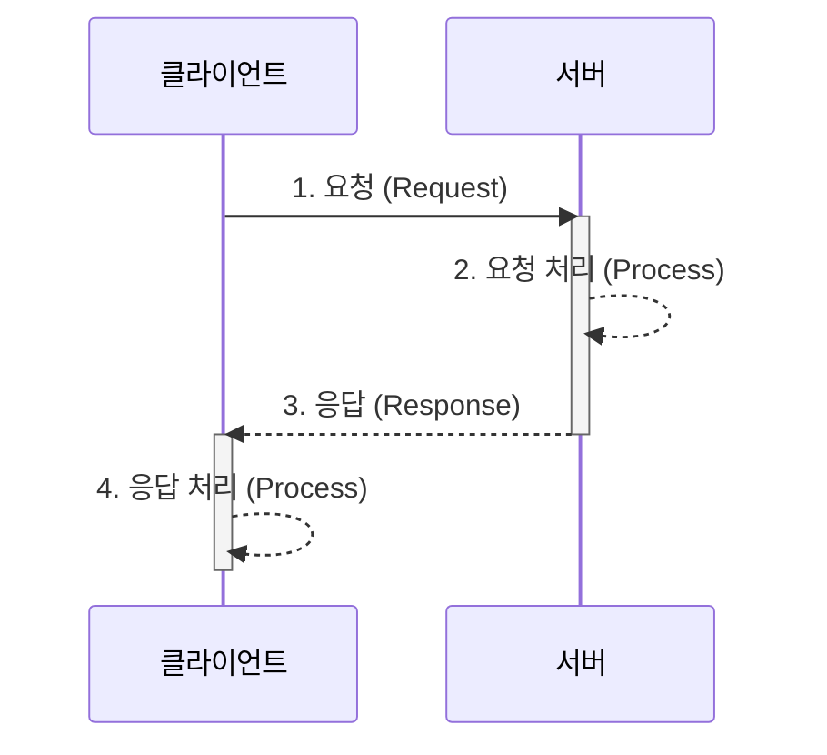

# 11.1 클라이언트-서버 프로그래밍 모델

모든 [[네트워크 애플리케이션]]은 **[[클라이언트-서버]] 모델**을 기반으로 합니다. 이 모델은 애플리케이션을 서비스를 **제공**하는 [[서버]] 프로세스와, 서비스를 **요청**하는 하나 이상의 [[클라이언트]] 프로세스로 구성합니다.

## 서버와 클라이언트

- **[[서버]]**: 특정 **자원(Resource)** 을 관리하고, 그 자원을 조작하여 클라이언트에게 서비스를 제공하는 [[프로세스]]입니다.
    
    - **예시**: 웹 서버는 클라이언트를 대신해 디스크 파일을 검색하고 실행합니다. [[FTP]] 서버는 파일을 저장하고 검색하며, 이메일 서버는 클라이언트를 위해 스풀 파일을 읽고 업데이트합니다.
        
- **[[클라이언트]]**: 서비스가 필요할 때 [[서버]]에 요청을 보내는 [[프로세스]]입니다.
    

> [!note] 프로세스 vs. 머신
> 
> 클라이언트와 서버는 물리적인 컴퓨터(호스트)가 아니라 프로세스라는 점을 이해하는 것이 중요합니다. 하나의 호스트에서 여러 클라이언트와 서버가 동시에 실행될 수 있으며, 클라이언트와 서버 트랜잭션은 같은 호스트 또는 다른 호스트에서 일어날 수 있습니다.

---

## 클라이언트-서버 트랜잭션

클라이언트-서버 모델의 기본 동작은 **트랜잭션(Transaction)** 입니다. 이 트랜잭션은 4단계로 구성됩니다.

1. **요청 (Request)**: 클라이언트는 서비스가 필요할 때, 서버에 **요청**을 보내 트랜잭션을 시작합니다. (예: 웹 브라우저가 파일을 필요로 할 때 웹 서버에 요청을 보냅니다.)
    
2. **처리 (Process)**: 서버는 요청을 받아 해석하고, 자신의 자원을 적절한 방식으로 조작합니다. (예: 웹 서버는 요청을 받으면 디스크 파일을 읽습니다.)
    
3. **응답 (Response)**: 서버는 클라이언트에 **응답**을 보낸 후, 다음 요청을 기다립니다. (예: 웹 서버는 파일을 클라이언트에게 다시 보냅니다.)
    
4. **처리 (Process)**: 클라이언트는 응답을 받아 처리합니다. (예: 웹 브라우저는 서버로부터 페이지를 받은 후 화면에 표시합니다.)